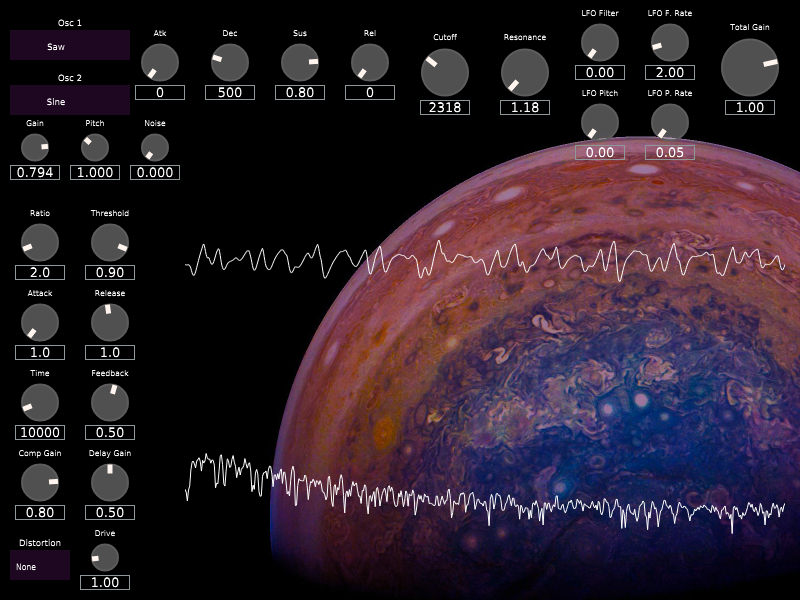

# BatSynth
A polyphonic synthesizer implemented in C++ (with JUCE).
An external midi device (like a usb keyboard) is required to make sounds! 
Any MIDI devices connected to your computer should be automatically detected through the JUCE framework and show up in the options menu.

This synthesizer has two sound oscillators, each with thirteen different wave shapes.
Click on the label boxes below Osc1 and Osc2 to adjust their current respective oscillator wave shapes. 
There is also a white noise oscillator that can be attenuated to your liking under the noise label.

There are Attack, Decay, Sustain, and Release controls that affect the time-based tonality of the synthesizer.
Attack determines how quickly the oscillator's wave shape reaches full volume
Decay determines how quickly the oscillator decays to the sustain ratio (relative to full volume)
Sustain determines the ratio to full volume of the sound after the decay time has passed
Release determines how quickly the oscillator decays to silence

After the ADSR circuit in the signal chain, there is a 12db per octave low pass resonant filter with
a cutoff frequency parameter to determine what audio frequency to begin filtering, and a resonance
control to determine how resonant the cutoff frequency will be in the final result (be careful!!)

